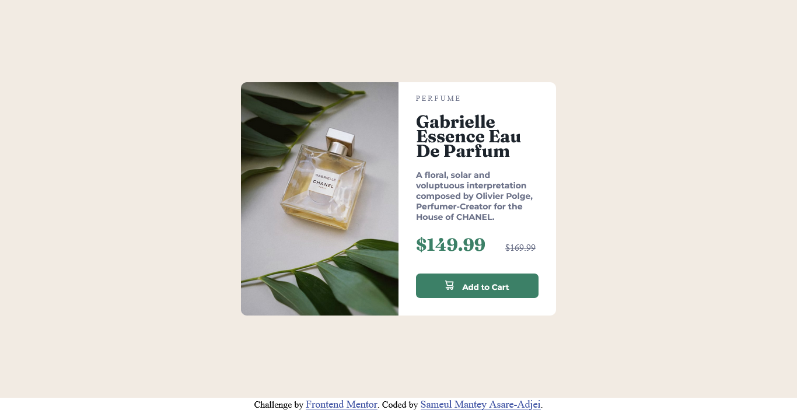
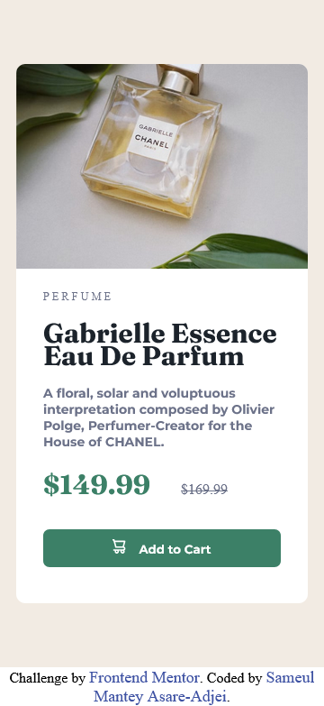

# Frontend Mentor - Product preview card component solution

This is a solution to the [Product preview card component challenge on Frontend Mentor](https://www.frontendmentor.io/challenges/product-preview-card-component-GO7UmttRfa). Frontend Mentor challenges help you improve your coding skills by building realistic projects. 

## Table of contents

- [Overview](#overview)
  - [The challenge](#the-challenge)
  - [Screenshot](#screenshot)
  - [Links](#links)
- [My process](#my-process)
  - [Built with](#built-with)
  - [What I learned](#what-i-learned)
  - [Continued development](#continued-development)
  - [Useful resources](#useful-resources)
- [Author](#author)
- [Acknowledgments](#acknowledgments)

**Note: Delete this note and update the table of contents based on what sections you keep.**

## Overview

### The challenge

Users should be able to:

- View the optimal layout depending on their device's screen size
- See hover and focus states for interactive elements

### Screenshot




  
### Links

- Solution URL: [Produuct-preview-card](https://sam-mantey.github.io/Product-preview-card/)
- Live Site URL: [Produuct-preview-card](https://sam-mantey.github.io/Product-preview-card/)

## My process

### Built with

- Semantic HTML5 markup
- CSS custom properties
- Flexbox


### What I learned

I learned how to make a webpage responsive using media queries. I also learnt how to switch between immages based on the screen size using the picture tag.


```html
<picture>
  <source  media="(min-width: 625px)" srcset="images/image-product-desktop.jpg">
  
</picture>
```

The code above ensures that the "image-product-desktop.jpg" dose not display on mobile devices.

I also learned hoew to add information which is only visible by screen readers.

```html
<span class="sr-only"> Old price </span>
```
```css
.sr-only {
    clip: rect(0 0 0 0); 
    clip-path: inset(50%);
    height: 1px;
    overflow: hidden;
    position: absolute;
    white-space: nowrap; 
    width: 1px;
}
```


The code above also ensures that the "Old price" text is only visible to screen readers.


### Continued development

In futre projects, I will focus on responsive design and CSS Grid system.


### Useful resources

- [Dani Krossing HTML and CSS tutorials](https://youtu.be/ZYV6dYtz4HA) - This helped me with the the responsive design. I really liked this pattern and will use it going forward.


## Author

- Frontend Mentor - [@sam_mantey](https://www.frontendmentor.io/profile/sam-mantey)
- Twitter - [@sam_mantey](https://www.twitter.com/sam_mantey)


## Acknowledgments

I thank [Danni Krossing](https://www.youtube.com/c/TheCharmefis) for the great and effective tutorials on CSS and HTML.
